# CITS3200_Project - Cheating Detection Tool

## Description From Client

### Tool 1

 document analysis tool When a student submits an assignment in the form of a Microsoft Word Document that was actually written by someone else various aspects of the document's metadata potentially provide clues that may help substantiate an allegation of cheating. It is often the case that when students obtain an essay or similar written by another person they lightly edit the document, for example, adding their name and institution. At times, it is possible that document Properties are wiped or provide insufficient data to conclude how the work was written. However, forensic techniques exist that can dig deeper into documents when they are unzipped as XML files. See: this <https://ieeexplore.ieee.org/stamp/stamp.jsp?arnumber=7324152>.

There are various clues in that can be drawn from the XML file that indicate potential cheating as outlines here <https://doi.org/10.1007/s10805-019-09358-w> and here <https://doi.org/10.1007/978-3-031-12680-2_12>

What I am proposing as a tool for the students to develop is a program (site etc) into which an MS Word document can be dropped or uploaded. The tool would then do the work of converting the file to a zip format, unzipping the file to its XML constituent parts, and analysing the relevant constituent parts to provide evidence to assess in cases of suspected cheating such as counts of revision identifiers, ratio of edited to words, versions of Word used, languages used in the document

In short, the tool would unzip and automate the analysis of cheating-relevant information in word documents. A really sophisticated version would also conduct a web search for any identified author or website author to see whether these are known cheating providers.

### Tool 2

This idea is simpler than the first. When students take online tests in LMS (Blackboard)it is possible to download a log the test activity that includes IP addresses from where the test was accessed, date and time, etc. This log is downloadable as a comma delimited file (*.csv), that people typically open in Excel.

When students outsource test completion to third parties well-known large-scale cheating providers are often off-shore in Kenya, China, Ukraine, and India or Pakistan. The second tool I propose would automatically search the IP column in the online test log and flag (highlight) suspicious activities such as logins from Kenya, logins from multiple IP addresses for the same student on repeatable tests, logins from discrepant locations at times that would make travel between the locations impossible, logins at unusual times (e.g. 12am-5am). Incorporating IP lookups into this process should be able to show whether addresses are VPNs or not.

An excellent tool would rank suspicious activity by counting and indicating when multiple red flags are apparent on the same test-taking incident (e.g., IP login from in Perth at 12am, followed by IP in Kenya, test taken at 3am).

+ Client: Guy Curtis
+ Phone: 0864883356
+ Email: <guy.curtis@uwa.edu.au>
+ Preferred contact: Email
+ Location: UWA

## To Launch Program

### 1. Clone Remote Repository

```bash
git clone https://github.com/lujor20/CITS3200_Project.git
```

### 2. Create a virtual environment

```bash
python3 -m venv dev-env
```

### 3. Open the virtual environment

#### Using Windows Powershell

```bash
dev-env\Scripts\Activate.ps1
```

#### Using Windows Command Prompt

```bash
dev-env\bin\activate.bat
```

#### Using Linux/MacOS

```bash
source dev-env/bin/activate
```

### 4. Install the Required libraries

```bash
pip install -r requirements.txt
```

### 5. Run the tool

```bash
flask run
```

## Creating AWS lightsail service

**Note:** This is not required to run the code on a single machine!! This will deploy the website using AWS so the website can be accessed by anyone.

### Requirements

In order for the tool to be deployed using Lightsail, the requirements needed are:

+ AWS account
  + <https://aws.amazon.com/getting-started/guides/setup-environment/>
  + You will need to use a debit/credit card when creating your account.
+ Configured AWS Command Line Interface (CLI)
  + <https://docs.aws.amazon.com/cli/latest/userguide/getting-started-install.html>
+ Docker installation
  + <https://docs.docker.com/engine/install/>
+ Lightsail control (lightsailctl) plugin
  + <https://lightsail.aws.amazon.com/ls/docs/en_us/articles/amazon-lightsail-install-software>

**Note: If installing on a university computer, you will need to contact the University IT department for temporary admin privileges in order to install the above requirements**

Once all the requirements are installed and the code within this repo downloaded, we can start the steps below.

### 1. Delete the virtual environment

We will no longer need the virtual environment since building the docker container will download all the requirements again.

**Delete the folder called dev-env from the folder containing the code.**
If you don't have this folder, skip this step

### 2. Navigate to the folder containing the code in your terminal

I have my code stored in the folder CITS3200_Project

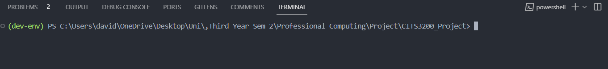

### 3. Build docker container

Run the command in the terminal

```bash
docker build -t flask-container .
```

This may take from 15 mins to 30 mins to finish.

If you see this error:

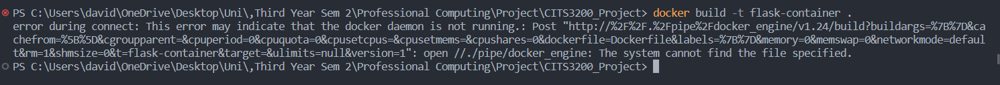

Open the docker application and run the command again.

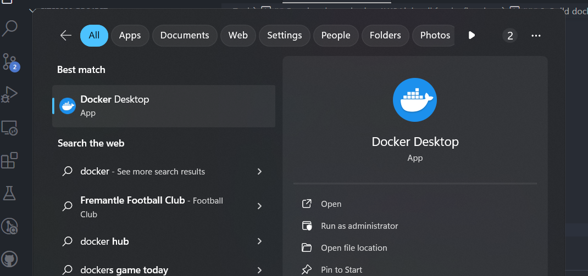

This is what will be displayed if successful
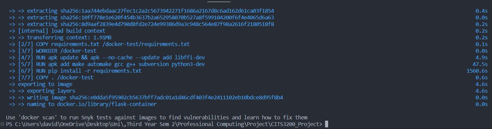

#### (Optional) Test the docker build

To test the build, run the following command

```bash
docker run -p 5000:5000 flask-container
```

Click on the <http://127.0.0.1:5000> and the website should work as intended.
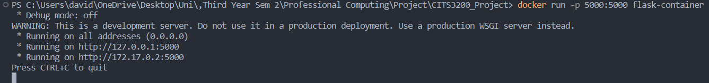

Close the server by clicking the stop (square) button in the docker application.
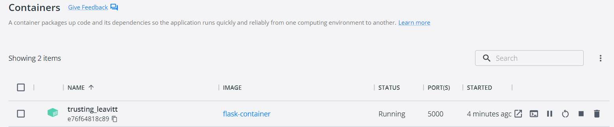

### 4. Create container service

This step will create a container on your Lightsail account. The name of the container is team21plagiarismdetection.

```bash
aws lightsail create-container-service --service-name team21plagiarismdetection --power small --scale 1
```

If it responds with a configuration error, make sure to configure (login) to the AWS CLI first and run the command again. (This is extremely complicated and there are guides that explains it better on the internet). See below websites for more detail.

+ <https://docs.aws.amazon.com/cli/latest/userguide/cli-chap-authentication.html>
+ <https://docs.aws.amazon.com/cli/latest/userguide/cli-configure-sso.html>

The container will appear as "team21plagiarismdetection" in the lightsail website <https://lightsail.aws.amazon.com/ls/webapp/home/containers>
**The "cits3200project" container was created previously**

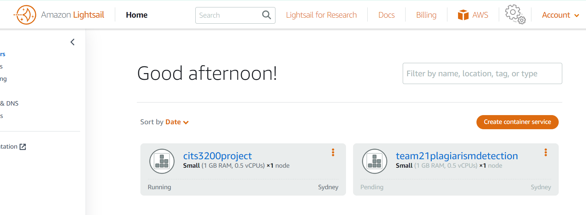

### 5. Push image to Lightsail

This will upload the docker image to the AWS container. It may take from 5 mins to 10 mins.

```bash
aws lightsail push-container-image --service-name team21plagiarismdetection --label flask-container --image flask-container
```

If successful, it will output:

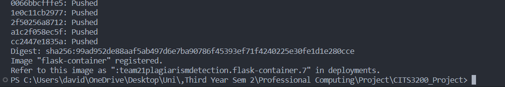

Take a note of the output. In this case, it tells me I should refer to this image as **:team21plagiarismdetection.flask-container.7**

### 6. Change deployment version

Open the file "containers.json" in the folder containing the code (with notepad)

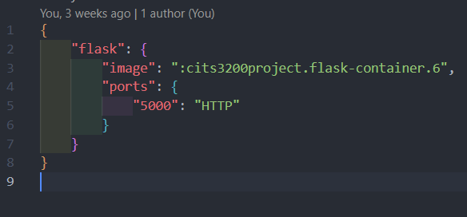

Edit the line

**"image": ":cits3200project.flask-container.6"**

and replace with the deployment version the terminal just outputted from the step above. In my case, this is my new file.

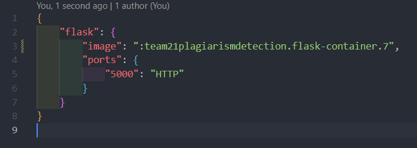

### 7. Deploy the image

This will make the website for you. This could take from 5 mins to 10 mins.

```bash
aws lightsail create-container-service-deployment --service-name team21plagiarismdetection --containers file://containers.json --public-endpoint file://public-endpoint.json
```

### 8. Check status

Open the Lightsail website 

<https://lightsail.aws.amazon.com/ls/webapp/home/instances>

Navigate to the containers and click on the container. You will see in the deployments tab (when you scroll to the bottom) that the status is deploying

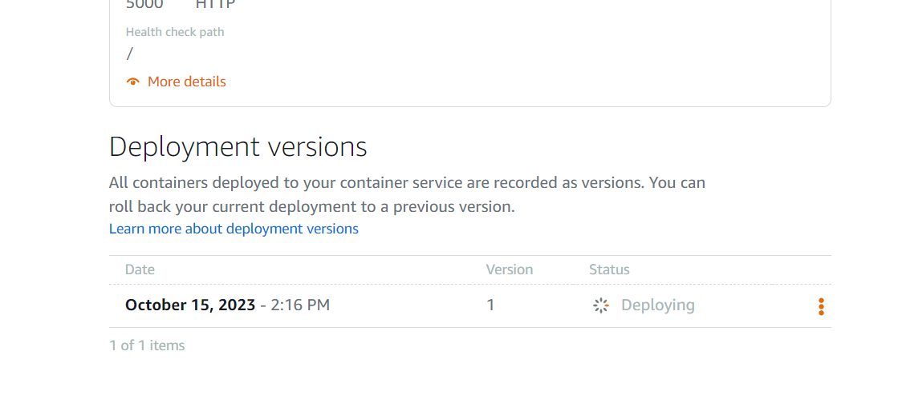

Wait until it is active. Takes around 3 mins.

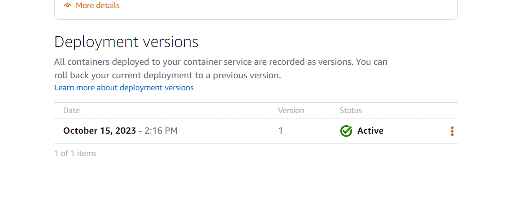

### 9. Open website

At the top of the page, there is a hyperlink labelled "public domain:".

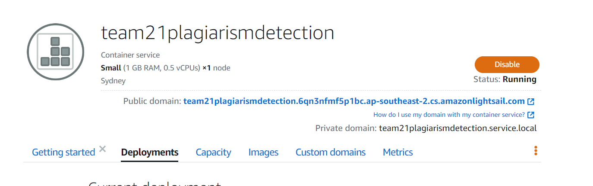

Clicking on the link will lead you to the website.

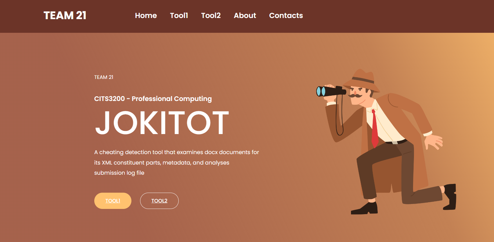

**IMPORTANT!!** By having a container (either running or disabled), you will pay a monthly fee ($15 aud/month for this particular one). The only way to stop paying is to delete the container, which is outlined below.

### (Optional) Delete container

To delete the container, go to the container menu on the Lightsail website, click the three dots and choose delete.

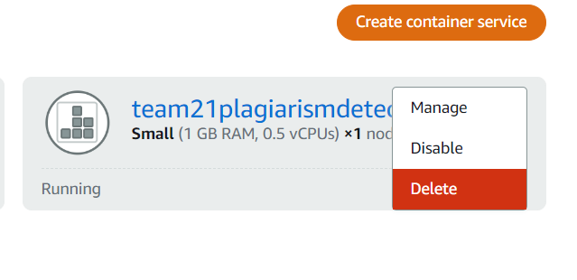

This is irreversible and can only be installed again by following the instructions.

## Updating AWS Lightsail

Go through these steps **ONLY** to update Lightsail to a newer version of the code

### 1. Download the new code from the repository

The new version of the code can be found at

<https://github.com/lujor20/CITS3200_Project/tree/main>

Click Code (Green button), then download zip

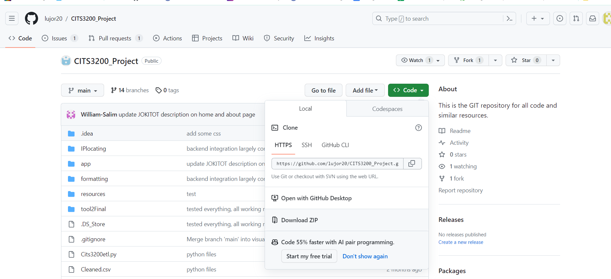

Extract the folder from the zip format and store the folder in a permanent location.

### 2. Follow the steps from create AWS Lightsail service

The next steps are exactly the same as the steps to set up the AWS Lightsail service EXCEPT for step 4, which can be skipped. To clarify, **follow steps 1, 2, 3, 5, 6, 7, 8 and 9**.

## Tool 1 Findings

### Forensics for Revision Identifiers

Revision Identifiers (RSID) is a 32-bit value represented by eight hex numbers which are stored in OOXML document (e.g. Microsoft Word - docx).
RSID contains useful information such as traces left from the modification of the document which could serve as evidence to assess in cases of suspected cheating.
Here are some properties of RSID values:

+ Probability of RSID value overlapping with pre-existing value is extremely low
+ RSID values differ between different editing session (period of editing which takes place between any two subsequent save actions)
+ RSID values are stored in "document.xml" and "settings.xml" files in the MS Word structure
+ Even after modifying or deleting the content, if at least one letter in the document remains for which RSID has already been assigned, the existing RSID remains in the document
+ Even if all the RSIDs in the "document.xml" file are deleted, the ones stored in the "settings.xml" file remain intact
+ If there is an MS Word file suspected of being a copy or a leaked file, all existing RSIDs are recorded within the "settings.xml" file, even if the user modifies or deletes the document content
+ RSID is not always copied and saved, but only under certain conditions. For RSID to be copied, the copied word or sentence must contain at least one customized font and not the default font (Calibri with font size 11)
+ If all the content the user wants to copy is in the default font, and it is copied and pasted into a new document or an existing document, the RSID assigned to the original file is not copied to the destination file
+ When the user copies the content from the original file into another file, the RSID is copied and stored in the "document.xml" file of the destination, but not in the "settings xml" file. Thus, if the RSID exists in the "document.xml" file but not in the "settings.xml" file, the user can see that this part is copied from the original file

### Analyzing Relevant XML Constituent Parts

+ Metadata information are usually stored in the folder docProps
+ Two or more XML files are stored inside that folder:
+ app.xml - stores metadata information extracted from the Word application itself
+ core.xml - stores metadata from the document itself, such as the author name, last time it was printed, etc
+ The file _rels/.rels contains information about the structure of the document. It contains paths to the metadata information as well as the main XML document that contains the content of the document itself
+ An XML file called document.xml is the main document, containing most of the content of the document itself

### Suspicious Indicators

+ Word has a total time edited file property. If the total editing time improbably large, maybe the file has been handed down over a number of years
+ AppVersion and OSVersion are data points that can be helpful in identifying discrepancies in a Word document. For example, if the OSVersion points to Windows 10, but none of the timestamps in the document are after 2013, you might want to take a closer look at that document
+ if someone has a Word document that is a few years old, or they are representing it as being a few years old, but it’s using a more recent, unique font, it is suspicious
+ It is alarming if you’ve got a five-page document that has an edit time of two minutes, or just one revision
+ By comparing the similarities between the document's temporary TMP file and autosaved ASD files can help in finding out if there are copy pasted content in the document

### Tools to explore

+ X-Ways v19.5 and FTK v6.4
+ Olefile and ExifTool
+ OfficeDissector
+ <https://github.com/abctemp90/Grouping_document_tool>

## Clare Johnson's findings

+ OOXML format = various components of each document are stored separately --> it is possiblle to unpack the file to explore its metadata

+ RSID values generated do not appear to increment throughout the editing process, or that if they do, it is not as simple as incrementing on the basis of edits carried out over a timeline

+ document creation date that precedes an assignment handout date would suggest that the
student has used a previously written assignment from someone else as the basis of their
response

+ An editing time that does not correlate with the length of the document would
suggest that text has been copied from another source.

+ This
information can be found under the File menu by selecting Properties and then the Statistics
tab,

+ The file containing most of the content is the document.xml file, and this file also contains
the main RSID markup for the document, showing all the edit runs that still remain within the
content and indicating how the document was built, as every edit that has taken place will sit
inside an RSID tag.

+ when an edit is done at a separate time (different editing session), the words being edited will contain its own newly added RSID value (rsidR) - since in a genuine work, students will maeke many of these edits, the result of the document will contain many RSID values

+ Contract cheating case: large chunks of text with no additional RSID editing values

+ if student submits the contracted work in its original form, there might be a lot of RSID values looking like an original work, but the creator name and device will not tally with the student who submitted it

+ rsidR = the rsid value for which the run was written (will increase as more edits are made)
+ rsidRDefault = the default rsid value assigned to the document initially

+ sharing of document does not share rsid values, so a shared document when saved locally, will not have the rsid values that indicate multiple editing sessions

+ genuine work metric example: words: 106; unique rsidR values: 12; ratio of edits to words: 11.32%;
+ after sharing and small editing: words: 106; unique rsidR values: 3; ratio of edits to words: 2.83%

+ genuine work metric essay example: words: 3685; unique rsidR values: 88; ratio of edits to words: 2.39%;
+ student's submission: words: 4172; unique rsidR values: 15; ratio of edits to words: 0.36%

+ possible useful metrics: word count, unique rsidR values, ratio of unique edits to words, total number of edits (rsidR values), ratio of total edits to words, ratio of rsidR to total edits

+ Better metrics: average number of words per run, average number of words per rsidR edit value

+ False positive consideration: document with small number of edits could result from student separating their work into sections and then copy pasted everything to a master document to be submitted or they use an online tool for grammatical check and copy pasted the result into a final copy

+ genuine work has less <w:rFont> element since there would usually be no need to reformat the text to a different font
+ copy pasted content from the internt usually requires a considerable amount of reformatting to match the default document = more <w:rFont> element

+ false positive consideration: this may be a relic of language conversion, so if the student had written the document in a language other than english and then needed to translate it for submission, there may be <w:rFont> tags appearing

+ Possible future work: establishing a timeline of content creation based on the rsid values generated (since they seem to be random hex values)
+ areas considered worthy of further exploration: reporting on frequency of minor edits, which could be indicative of spelling corrections, grammatical alterations and name changes, consistent with changes to contracted work as well as testing the methods on copy-and-paste plagiarism

+ it might also be useful to highlight large blocks of undedited text to an assessor
